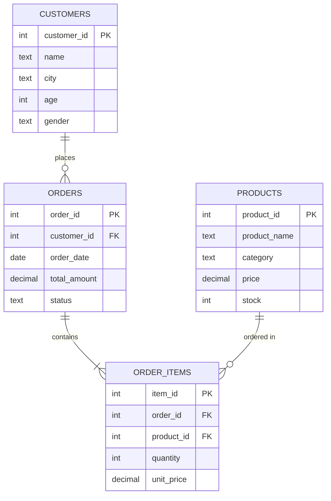
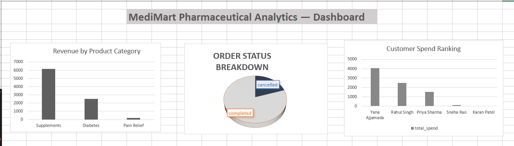
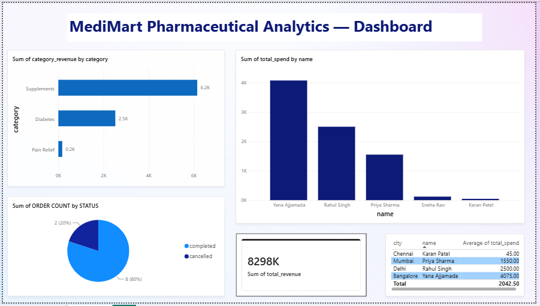

<div align="center">


<br><br>


<br><br>

[](https://linkedin.com/in/yanaajjamada)
[](https://github.com/yanaajjamada-crypto)


</div>

<br>


## 🎯 Why This Project Exists

Most beginner SQL projects stop at *"here's a query and its output."* This one doesn't. 💭

Every query here starts from a **real business question** — *"who are our loyal customers?"*, *"which category is underperforming?"*, *"who's the top spender in each city?"* — and ends in a **visual** a stakeholder could actually act on.

Built while transitioning from pharma R&D into Product & Data roles — pharma-flavored on purpose, to bridge my domain background with the tooling of a data-driven PM. 🧪➡️📊


## 📊 At a Glance

<div align="center">

<table>
<tr>
<td align="center">🗃️<br><b>4</b><br>Tables</td>
<td align="center">🧮<br><b>10</b><br>SQL Queries</td>
<td align="center">💰<br><b>₹8,290</b><br>Total Revenue</td>
<td align="center">🏆<br><b>Supplements</b><br>Top Category</td>
<td align="center">👑<br><b>Yana A.</b><br>Top Spender</td>
<td align="center">📈<br><b>2</b><br>Dashboards</td>
</tr>
</table>

</div>


## 🗂️ Database Design

Four normalized tables, connected through foreign keys — a realistic mini e-commerce schema.



> 💡 This diagram renders live on GitHub — pure Markdown, no image file needed.


## 🧠 The 10 Business Questions

Progressing from basic aggregation → joins → subqueries → CTEs → window functions.

<table>
<tr><th>#</th><th>Question</th><th>SQL Concepts</th></tr>
<tr><td>1</td><td>What's the breakdown of order statuses?</td><td><code>GROUP BY</code>, <code>COUNT</code></td></tr>
<tr><td>2</td><td>What's total revenue from completed orders?</td><td><code>SUM</code>, <code>WHERE</code></td></tr>
<tr><td>3</td><td>Which product category earns the most revenue?</td><td><code>JOIN</code>, <code>GROUP BY</code>, <code>ORDER BY</code></td></tr>
<tr><td>4</td><td>How many orders has each customer placed?</td><td><code>LEFT JOIN</code>, <code>COUNT</code></td></tr>
<tr><td>5</td><td>Which Bangalore customers completed orders?</td><td><code>JOIN</code>, <code>WHERE</code>, <code>DISTINCT</code></td></tr>
<tr><td>6</td><td>Which products have never been ordered?</td><td>Subquery, <code>NOT IN</code></td></tr>
<tr><td>7</td><td>How do customers segment by order frequency?</td><td><code>CASE WHEN</code></td></tr>
<tr><td>8</td><td>Who's the top spender in each city?</td><td>CTE, <code>ROW_NUMBER()</code>, <code>PARTITION BY</code></td></tr>
<tr><td>9</td><td>How do customers rank by total spend?</td><td><code>DENSE_RANK()</code></td></tr>
<tr><td>10</td><td>Which customers spend above the average?</td><td>Multiple CTEs, <code>AVG() OVER()</code></td></tr>
</table>

📄 Full file: [`sql/medimart_queries.sql`](sql/medimart_queries.sql)

<details>
<summary><b>🔍 Click to expand a sample query — Q8: Top Spender per City (CTE + Window Function)</b></summary>
<br>

```sql
WITH customer_spend AS (
    SELECT c.customer_id, c.name, c.city,
        SUM(o.total_amount) AS total_spend
    FROM customers c
    JOIN orders o ON c.customer_id = o.customer_id
    WHERE o.status = 'completed'
    GROUP BY c.customer_id, c.name, c.city
),
ranked_spend AS (
    SELECT customer_id, name, city, total_spend,
        ROW_NUMBER() OVER (
            PARTITION BY city
            ORDER BY total_spend DESC
        ) AS row_num
    FROM customer_spend
)
SELECT name, city, total_spend
FROM ranked_spend
WHERE row_num = 1;
```

**Why it matters:** finding a "top N per group" is one of the most common real-world analytics asks — clean only with a window function partitioned by group. 🎯

</details>


## 💡 Key Insights

> 🏆 **Supplements dominate revenue** — ₹6,150, nearly **3x** Diabetes and **36x** Pain Relief. A supplements-led growth story, not a prescription-led one.

> 👑 **One customer, outsized impact** — Yana Ajjamada alone accounts for **~49%** of total completed revenue (₹4,075 of ₹8,290), and is the only "Loyal" customer (3+ orders). Concentration risk worth flagging.

> 📉 **20% cancellation rate** — 2 of 10 orders cancelled, both from customers who never ordered again — worth investigating in a real dataset.

> 🌆 **No cross-city loyalty overlap** — every city's top spender is a different person, pointing to distributed demand rather than one dominant hub.


## 📈 Excel Dashboard

<div align="center">

</div>

Built directly from SQL query outputs — 3 charts covering category revenue, order status split, and customer spend ranking.

📄 File: [`excel/medimart_analysis.xlsx`](excel/medimart_analysis.xlsx)


## ⚡ Power BI Dashboard

<div align="center">

</div>

An interactive, filterable version of the same insights — 5 linked visuals, cross-highlighting enabled by default.

| Visual | Type | Insight |
|---|---|---|
| Revenue by Category | Bar chart | Supplements lead by a wide margin |
| Order Status | Pie chart | 80/20 completed-to-cancelled split |
| Customer Spend Ranking | Column chart | Clear spend hierarchy across customers |
| Total Revenue | KPI card | ₹8,290 at a glance |
| Top Spender per City | Table | City-level customer leaders |

📄 Files: [`powerbi/medimart_dashboard.pbix`](powerbi/medimart_dashboard.pbix) · [`powerbi/medimart_dashboard.pdf`](powerbi/medimart_dashboard.pdf)


## 🛠️ Tech Stack

<div align="center">

| Layer | Tool | What I Used It For |
|:---|:---|:---|
| 🗄️ Database | SQLite + DB Browser | Schema design, query development & testing |
| 🧮 Query Layer | SQL | CTEs, window functions, subqueries, joins, CASE logic |
| 📊 Reporting | Microsoft Excel | Data consolidation, chart-based static dashboard |
| ⚡ BI Layer | Power BI Desktop | Interactive, cross-filterable 5-visual dashboard |
| 🔧 Version Control | Git & GitHub | Project hosting & portfolio presentation |

</div>


## 📁 Repository Structure

```
medimart-analytics-project/
├── README.md
├── data/
│   └── medimart.db
├── sql/
│   └── medimart_queries.sql
├── excel/
│   └── medimart_analysis.xlsx
├── powerbi/
│   ├── medimart_dashboard.pbix
│   └── medimart_dashboard.pdf
└── images/
    ├── excel_dashboard_screenshot.png
    └── powerbi_dashboard_screenshot.png
```


## 🚀 How to Explore This Project

1. **Run the queries yourself** — open `data/medimart.db` in [DB Browser for SQLite](https://sqlitebrowser.org/) (free) and execute anything from `sql/medimart_queries.sql`
2. **Browse the Excel dashboard** — just open `excel/medimart_analysis.xlsx`
3. **Play with the interactive report** — open `powerbi/medimart_dashboard.pbix` in [Power BI Desktop](https://www.microsoft.com/en-us/power-platform/products/power-bi/downloads) (free), or view the static PDF if you don't have Power BI installed

<br>

<div align="center">


**Yana Ajjamada** · M.Sc. Organic Chemistry → Product & Data Analytics

[](https://linkedin.com/in/yanaajjamada)
[](https://github.com/yanaajjamada-crypto)

⭐ *If this project was useful or interesting, a star would mean a lot!*

</div>

